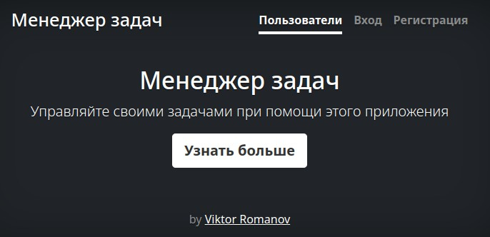

### Hexlet tests and linter status:
[](https://github.com/qffo/python-project-52/actions)
[](https://github.com/qffo/python-project-52/actions)
[](https://codeclimate.com/github/qffo/python-project-52/maintainability)
[](https://codeclimate.com/github/qffo/python-project-52/test_coverage)

## Description

Task Manager – web application. It allows you to set tasks, assign performers and change their statuses.

Demo -> https://python-project-52-by4e.onrender.com/



## Minimum requirements for starting a project:
- Python version 3.11
- Pip version 24.2
- Poetry version 1.8.3

This project was created using these tools:

| Tools                                                           | Description                                       |
|-----------------------------------------------------------------|---------------------------------------------------|
| [poetry](https://python-poetry.org/)                            | "Python Dependency Management"                    |
| [django](https://djangoproject.com/)                            | "High-level Python web framework"                 |
| [gunicorn](https://gunicorn.org/)                               | "Python WSGI HTTP Server for UNIX"                |
| [django-bootstrap5](https://django-bootstrap5.readthedocs.io/)  | "Bootstrap 5 for Django."                         |
| [rollbar](https://rollbar.com/)                                 | "Platform for real-time error tracking and troubleshooting"   |
| [ruff](https://pypi.org/project/ruff/)                          | "Linter"                                          |
---

#### Cloning a repository
```
git clone git@github.com:qffo/python-project-52.git
cd python-project-52
```  
#### Secret keys
Create a file for environment variables in the python-project-52 .env directory with the following information:
- .env_example
#### Installing dependencies
```make install```  
#### Development and local use
```make dev```  
#### Deployment commands
```
make build    
make start
```  